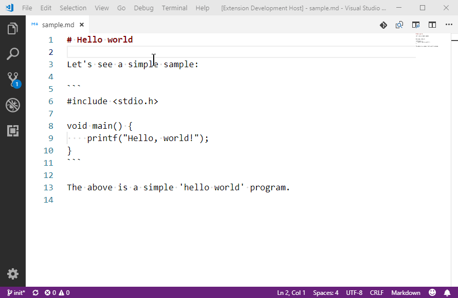

# Insert Line Number

This extension is used to insert line number to a text document which is being edited.

> *Note*,
> This extensions inserts real pure text-based line numbers to each line,
> so it's typically used for code samples for easily indicating the metioned
> lines; it's not suitable for real code file.

## Features

The line numbers can be inserted to selected lines or the whole document if no any selected lines.

User can select different formats among multiple predefined formats, which can be defined in settings.

## Extension Settings

### `InsertLineNumber.formats`

`InsertLineNumber.formats` is an array of `InsertLineNumberConfig.Format` objects, which have the following properties:

----
#### Property: `start`
Line number of the first line.
##### Default value: `1`
##### Type: `"current" | number`
- `"current"`: Starts from the real current line number.
For example, user selects line 10-15 in the editor,
line numbers 10-15 will be inserted to these lines.
- `number`: Starts from the given number.
For example, when the 'start' is set to 1, and
user selects line 10-15 in the editor,
line number 1-6 will be inserted to these lines.

----
#### Property: `align`
Alignment of the line number.
> *Note*,
> The alignment only apply to the formatted number, no matter the perfix and suffix.
> For example, when prefix is 'C_' and suffix is ':', the result may be 'C_1  :' or 'C_12 :'.

##### Default value: `"left"`
##### Type: `"left" | "right"`
- `"left"`: Align to left.
- `"right"`: Align to right.

----
#### Property: `padding`
Padding char to satisfy padding to the width.
##### Default value: `"space"`
##### Type: `"space" | "zero"`
- `"space"`: Pad line numbers with whitespaces.
- `"zero"`: Pad line numbers with 0.

----
#### Property: `width`
Width of each line number.
> *Note*,
> if a line number were longer than the specified width,
> it won't be truncated.
##### Default value: `"normal"`
##### Type: `"normal" | "alignToLast" | number`
`"normal"`: No padding, keep the line numbers as-is.
`"alignToLast"`: Pad the line numbers to the last (longest) one.
`number`: Pad the line numbers to the given width.

----
#### Property: `prefix`
Perfix would be inserted before the formatted line number.
##### Default value: `""`
##### Type: `string`

----
#### Property: `suffix`
Suffix would be inserted after the formatted line number.
##### Default value: `":  "`
##### Type: `string`

----
#### Property: `skipNumber`
If set to `true`, the numeric line number is omitted and only `prefix + suffix` are inserted for each line.
Useful when you just want to bulk add comment markers or bullets without actual numbers.
##### Default value: `false`
##### Type: `boolean`

----
#### Property: `afterLeadingWhitespace`
If set to `true`, the formatted line number (or just prefix+suffix when `skipNumber` is true) is inserted AFTER the existing leading whitespace of each line (i.e. after indentation). When `false`, insertion happens at column 0 before the indentation.
##### Default value: `false`
##### Type: `boolean`

**Enjoy!**
